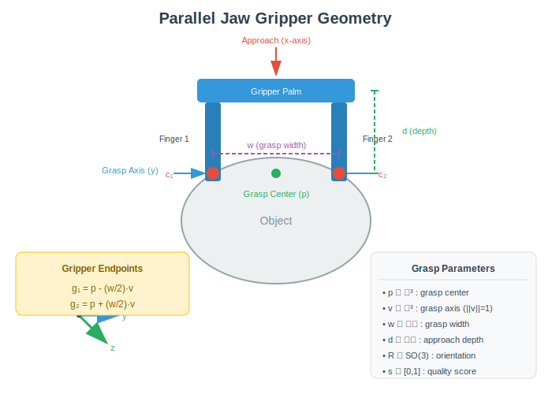
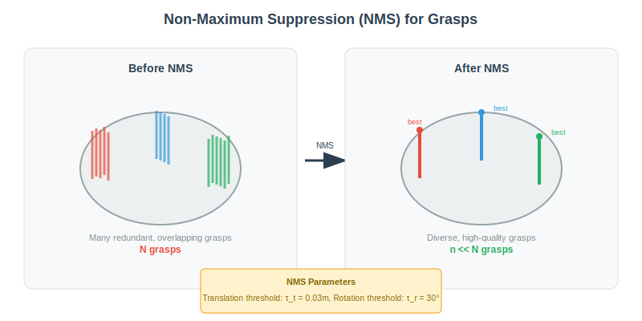
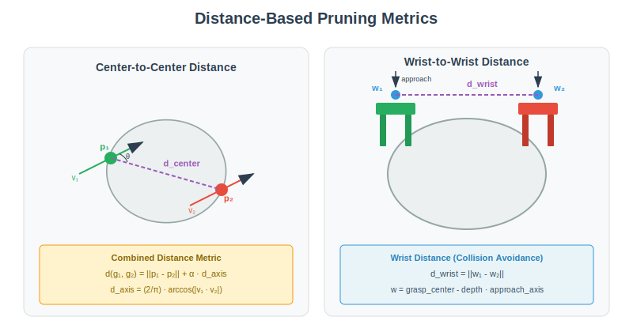

# Dual-Arm Grasp Dataset Generator

## Abstract

This report presents a detailed theoretical analysis of a dual-arm grasp generation pipeline for robotic manipulation. The system transforms single-arm parallel-jaw grasps into coordinated dual-arm grasp configurations that satisfy force closure constraints. We formalize the mathematical foundations including grasp representation, coordinate transformations, combinatorial pairing strategies, distance-based pruning metrics, contact mechanics, and convex optimization for force closure verification.

---

## Table of Contents

1. [Introduction](#1-introduction)
2. [System Overview](#2-system-overview)
3. [Grasp Representation and Data Acquisition](#3-grasp-representation-and-data-acquisition)
4. [Grasp Preprocessing](#4-grasp-preprocessing)
5. [Grasp-to-Object Assignment](#5-grasp-to-object-assignment)
6. [Collision Detection and Filtering](#6-collision-detection-and-filtering)
7. [Dual-Arm Grasp Pair Generation](#7-dual-arm-grasp-pair-generation)
8. [Distance-Based Pruning](#8-distance-based-pruning)
9. [Contact Point Computation](#9-contact-point-computation)
10. [Surface Normal Estimation](#10-surface-normal-estimation)
11. [Grasp Map Construction](#11-grasp-map-construction)
12. [Force Closure Optimization](#12-force-closure-optimization)
13. [Scoring and Selection](#13-scoring-and-selection)
14. [Conclusion](#14-conclusion)

---

## 1. Introduction

Dual-arm robotic manipulation enables handling of objects that are too large, heavy, or require coordinated forces for stable grasping. Unlike single-arm grasping, dual-arm configurations provide additional contact points, enabling more robust force distribution and the ability to resist external disturbances from multiple directions.

The fundamental challenge in dual-arm grasp planning is to select two single-arm grasps that, when executed simultaneously, form a stable grasp configuration. This stability is formally characterized by the concept of **force closure**—the ability of the grasp to resist arbitrary external wrenches (forces and torques) applied to the object.


### Key Contributions

This pipeline addresses:
- Efficient generation of dual-arm grasp candidates from single-arm grasp databases
- Geometric pruning to eliminate kinematically infeasible configurations
- Rigorous force closure verification through convex optimization
- Quality scoring for grasp selection

---

## 2. System Overview

The dual-arm grasp generation pipeline consists of ten distinct stages, progressing from raw grasp data to verified force-closure grasp pairs.

### Pipeline Stages

| Stage | Description | Input | Output |
|-------|-------------|-------|--------|
| 1 | Data Loading | Scene ID, Annotation ID | Raw grasp candidates |
| 2 | Non-Maximum Suppression | Dense grasps | Filtered grasp set |
| 3 | Object Assignment | Scene point cloud | Per-object grasp lists |
| 4 | Collision Detection | Grasp configurations | Collision-free grasps |
| 5 | Pair Generation | Single grasps | All possible pairs |
| 6 | Distance Pruning | Grasp pairs | Geometrically valid pairs |
| 7 | Contact Computation | Valid pairs | Contact points |
| 8 | Normal Estimation | Contact points | Surface normals |
| 9 | Grasp Map Construction | Contacts + normals | Grasp matrices |
| 10 | Force Closure Optimization | Grasp maps | Verified pairs + scores |

### Stage Categories

The pipeline can be organized into four functional categories:

1. **Data Preprocessing** (Stages 1-3): Loading grasp data, applying NMS, and assigning grasps to objects
2. **Collision Analysis** (Stage 4): Filtering grasps that would cause gripper-scene collision
3. **Pairing & Pruning** (Stages 5-6): Generating candidate pairs and applying geometric constraints
4. **Force Closure Verification** (Stages 7-10): Computing contacts, constructing grasp maps, and solving the optimization

---

## 3. Grasp Representation and Data Acquisition

### 3.1 Parallel-Jaw Grasp Parameterization

A parallel-jaw grasp is represented by a 17-dimensional vector encoding the complete grasp configuration:

$$\mathbf{g} = [s, w, h, d, \mathbf{R}, \mathbf{t}, o]^T \in \mathbb{R}^{17}$$

where:
- $s \in [0, 1]$: Grasp quality score
- $w \in \mathbb{R}^+$: Gripper opening width (meters)
- $h \in \mathbb{R}^+$: Gripper finger height (meters)
- $d \in \mathbb{R}^+$: Approach depth (meters)
- $\mathbf{R} \in SO(3)$: Rotation matrix (9 elements, flattened)
- $\mathbf{t} \in \mathbb{R}^3$: Translation vector (grasp center position)
- $o \in \mathbb{Z}$: Object ID



### 3.2 Grasp Reference Frame

The grasp reference frame is defined with respect to the gripper geometry:

- **X-axis (Approach)**: Points from the wrist toward the object along the gripper palm normal
- **Y-axis (Grasp axis)**: Points from one jaw to the other, perpendicular to finger surfaces
- **Z-axis**: Orthogonal to both, completing the right-handed coordinate frame

The rotation matrix $\mathbf{R}$ transforms vectors from the grasp frame to the camera/world frame:

$$\mathbf{R} = [\mathbf{x} \; | \; \mathbf{y} \; | \; \mathbf{z}]$$

### 3.3 Gripper Endpoint Computation

The jaw endpoints (fingertip positions at maximum opening) are computed as:

$$\mathbf{g}_1 = \mathbf{t} - \frac{w}{2} \cdot \mathbf{y}$$

$$\mathbf{g}_2 = \mathbf{t} + \frac{w}{2} \cdot \mathbf{y}$$

where $\mathbf{y}$ is the grasp axis (second column of $\mathbf{R}$).

### 3.4 Data Source: GraspNet-1Billion and DG16M

The grasp candidates are sourced from established grasp datasets:

**GraspNet-1Billion** [2] provides:
- Dense 6-DOF grasp annotations for 190 scenes
- Point cloud data from RGB-D sensors (RealSense and Kinect)
- Object pose annotations for 88 object categories
- Pre-computed grasp quality scores based on analytic metrics

**DG16M** [6] extends this with:
- 16 million dual-arm grasp annotations
- Force closure verified grasp pairs
- Diverse object categories and scene configurations
- Coordinated dual-arm manipulation labels

---

## 4. Grasp Preprocessing

### 4.1 Non-Maximum Suppression (NMS)

Raw grasp databases contain numerous redundant grasps clustered around favorable grasp locations. Non-Maximum Suppression reduces this redundancy while preserving diversity.



#### NMS Algorithm

Given a set of grasps $\mathcal{G} = \{g_1, g_2, ..., g_N\}$ sorted by descending quality score:

1. Initialize the selected set $\mathcal{S} = \emptyset$
2. For each grasp $g_i$ in sorted order:
   - If $\forall g_j \in \mathcal{S}: d(g_i, g_j) > \tau$, add $g_i$ to $\mathcal{S}$
3. Return $\mathcal{S}$

#### Distance Metric for NMS

The grasp distance combines translational and rotational components:

$$d(g_i, g_j) = \|\mathbf{t}_i - \mathbf{t}_j\|_2 + \alpha \cdot d_{rot}(\mathbf{R}_i, \mathbf{R}_j)$$

where the rotational distance is:

$$d_{rot}(\mathbf{R}_i, \mathbf{R}_j) = \arccos\left(\frac{\text{tr}(\mathbf{R}_i^T \mathbf{R}_j) - 1}{2}\right)$$

#### NMS Parameters

| Parameter | Symbol | Value | Description |
|-----------|--------|-------|-------------|
| Translation threshold | $\tau_t$ | 0.03 m | Minimum center distance |
| Rotation threshold | $\tau_r$ | 30° ($\pi/6$ rad) | Minimum orientation difference |

### 4.2 Significance of NMS

NMS serves multiple purposes:
1. **Computational efficiency**: Reduces the $O(n^2)$ pairing complexity
2. **Diversity**: Ensures exploration of different grasp configurations
3. **Quality retention**: Keeps highest-scoring grasp from each cluster

---

## 5. Grasp-to-Object Assignment

In cluttered scenes with multiple objects, each grasp must be assigned to its target object. This assignment enables per-object processing and prevents invalid cross-object grasp pairs.

### 5.1 Scene Point Cloud Construction

For each object $i$ with model points $\mathcal{M}_i$ and pose $\mathbf{T}_i \in SE(3)$:

$$\mathcal{M}_i^{world} = \mathbf{T}_i \cdot \mathcal{M}_i$$

The scene point cloud is the union:

$$\mathcal{S} = \bigcup_{i=1}^{n} \mathcal{M}_i^{world}$$

### 5.2 Assignment via Nearest Neighbor

For each grasp with center $\mathbf{t}$, find the nearest scene point:

$$k^* = \arg\min_{k} \|\mathbf{t} - \mathbf{p}_k\|_2, \quad \mathbf{p}_k \in \mathcal{S}$$

The grasp is assigned to object $i$ if $\mathbf{p}_{k^*} \in \mathcal{M}_i^{world}$.

### 5.3 Segmentation Mask

A segmentation mask $\mathbf{m} \in \mathbb{Z}^{|\mathcal{S}|}$ encodes the object membership:

$$m_k = i \quad \text{if} \quad \mathbf{p}_k \in \mathcal{M}_i^{world}$$

This enables O(1) lookup after the nearest neighbor search.

---

## 6. Collision Detection and Filtering

Collision detection eliminates grasps where the gripper would intersect with the scene geometry.

### 6.1 Gripper Collision Model

The parallel-jaw gripper is modeled as three rectangular regions:
- **Left finger**: Width $w_f$, height $h$, depth $d$
- **Right finger**: Symmetric to left
- **Palm/base**: Connects fingers at the back

### 6.2 Point-in-Gripper Test

For each scene point $\mathbf{p}$, transform to the gripper coordinate frame:

$$\mathbf{p}_{grip} = \mathbf{R}^T (\mathbf{p} - \mathbf{t})$$

A point collides with the left finger if:

$$
 \begin{cases} 
      -\frac{h}{2} < p_{grip,z} < \frac{h}{2} \\
      -d_{base} < p_{grip,x} < d \\
      -\frac{w}{2} - w_f < p_{grip,y} < -\frac{w}{2}
   \end{cases}
$$

Similar conditions apply for the right finger and palm regions.

### 6.3 Collision Mask Computation

The collision mask for grasp $j$ is:

$$\text{collision}_j = \bigvee_{k=1}^{|\mathcal{S}|} \text{in\_finger}(\mathbf{p}_k, g_j)$$

### 6.4 Empty Grasp Detection

Grasps with too few points between the fingers indicate invalid configurations:

$$\text{empty}_j = \left( \sum_{k} \text{in\_inner}(\mathbf{p}_k, g_j) < \tau_{empty} \right)$$

where $\tau_{empty} = 10$ points is the minimum threshold.

---

## 7. Dual-Arm Grasp Pair Generation

### 7.1 Combinatorial Pairing

For an object with $n$ valid single-arm grasps, all possible pairs are generated:

$$\mathcal{P} = \{(g_i, g_j) \; | \; 1 \leq i < j \leq n\}$$

The number of pairs follows the binomial coefficient:

$$|\mathcal{P}| = \binom{n}{2} = \frac{n(n-1)}{2}$$

### 7.2 Computational Complexity

This combinatorial explosion motivates the subsequent pruning stages:

| Number of grasps ($n$) | Number of pairs |
|------------------------|-----------------|
| 10 | 45 |
| 50 | 1,225 |
| 100 | 4,950 |
| 500 | 124,750 |

---

## 8. Distance-Based Pruning

Distance-based pruning eliminates geometrically unsuitable grasp pairs before expensive force closure computation.



### 8.1 Center-to-Center Distance

Grasps that are too close may cause gripper collision or provide insufficient force distribution:

$$d_{c2c}(g_1, g_2) = \|\mathbf{t}_1 - \mathbf{t}_2\|_2 + \alpha \cdot d_{axis}$$

where the axis distance penalizes parallel grasps:

$$d_{axis} = \frac{2}{\pi} \arccos(|\mathbf{y}_1 \cdot \mathbf{y}_2|)$$

The term $|\mathbf{y}_1 \cdot \mathbf{y}_2|$ is clamped to $[0, 1]$ to handle numerical issues.

#### Significance of Axis Distance

- $|\mathbf{y}_1 \cdot \mathbf{y}_2| = 1$: Parallel grasps ($d_{axis} = 0$)
- $|\mathbf{y}_1 \cdot \mathbf{y}_2| = 0$: Perpendicular grasps ($d_{axis} = 1$)

Parallel grasps provide poor force closure as they cannot resist torques about their common axis.

### 8.2 Wrist-to-Wrist Distance

The wrist position is computed by projecting backward along the approach direction:

$$\mathbf{w} = \mathbf{t} - d_{approach} \cdot \mathbf{x}$$

where $d_{approach}$ is the approach distance (typically 0.1m).

The wrist-to-wrist distance ensures physical separation of the robot arms:

$$d_{w2w}(g_1, g_2) = \|\mathbf{w}_1 - \mathbf{w}_2\|_2$$

### 8.3 Pruning Criteria

A grasp pair is retained only if both conditions are satisfied:

$$\text{valid}(g_1, g_2) = (d_{c2c} > \tau_{c2c}) \land (d_{w2w} > \tau_{w2w})$$

#### Pruning Parameters

| Parameter | Symbol | Primary Value | Fallback Value |
|-----------|--------|---------------|----------------|
| Center distance threshold | $\tau_{c2c}$ | 0.06 m | 0.045 m |
| Wrist distance threshold | $\tau_{w2w}$ | 0.1 m | 0.1 m |
| Axis weight | $\alpha$ | 0.00025 | — |

If no pairs pass with primary thresholds, fallback values are used.

---

## 9. Contact Point Computation

### 9.1 Line of Action

For each gripper jaw, a **line of action** traces the path from the open position to the contact point. Starting from endpoint $\mathbf{g}_i$, the line extends along the grasp axis:

$$\mathcal{L}_1 = \{\mathbf{g}_1 + \lambda \cdot \mathbf{y} \; | \; \lambda \in [0, w]\}$$

$$\mathcal{L}_2 = \{\mathbf{g}_2 - \lambda \cdot \mathbf{y} \; | \; \lambda \in [0, w]\}$$

### 9.2 Contact Detection via SDF

The Signed Distance Function (SDF) $\phi: \mathbb{R}^3 \rightarrow \mathbb{R}$ encodes the distance to the object surface:
- $\phi(\mathbf{p}) > 0$: Point is outside the object
- $\phi(\mathbf{p}) < 0$: Point is inside the object
- $\phi(\mathbf{p}) = 0$: Point is on the surface

Contact occurs at the first zero-crossing along the line of action:

$$\mathbf{c} = \arg\min_{\mathbf{p} \in \mathcal{L}} \|\mathbf{p} - \mathbf{g}\| \quad \text{s.t.} \quad \phi(\mathbf{p}) \leq 0$$

### 9.3 Grid Coordinate Transformation

The SDF is stored in a voxel grid. Points are transformed between object coordinates and grid coordinates:

$$\mathbf{p}_{grid} = \frac{\mathbf{p}_{obj} - \mathbf{o}_{min}}{\Delta}$$

where $\mathbf{o}_{min}$ is the grid origin and $\Delta$ is the voxel size.

### 9.4 Four-Point Contact Configuration

For a dual-arm grasp, four contact points are computed:
- $\mathbf{c}_1, \mathbf{c}_2$: Contacts from gripper 1
- $\mathbf{c}_3, \mathbf{c}_4$: Contacts from gripper 2

This four-point contact configuration provides 12 force components (3 per contact) to balance the 6-DOF wrench space.

---

## 10. Surface Normal Estimation

### 10.1 SDF Gradient Method

The surface normal at a contact point is computed as the normalized gradient of the SDF:

$$\mathbf{n} = \frac{\nabla \phi(\mathbf{c})}{\|\nabla \phi(\mathbf{c})\|}$$

The gradient is approximated using central differences:

$$\frac{\partial \phi}{\partial x_i} \approx \frac{\phi(\mathbf{c} + h\mathbf{e}_i) - \phi(\mathbf{c} - h\mathbf{e}_i)}{2h}$$

### 10.2 Mesh-Based Normal Lookup

Alternatively, for triangular meshes, the normal is obtained from the nearest face:

1. Find the nearest point on the mesh surface to $\mathbf{c}$
2. Identify the face containing this point
3. Return the face normal $\mathbf{n}_f$

### 10.3 Normal Direction Convention

**Critical**: Normals must point **inward** toward the object interior for the contact model. If the SDF gradient points outward, it is negated:

$$\mathbf{n}_{in} = -\mathbf{n} \quad \text{if} \quad \mathbf{n} \cdot \mathbf{d}_{grasp} < 0$$

---

## 11. Grasp Map Construction

The grasp map relates contact forces to the resultant wrench on the object.

### 11.1 Contact Reference Frame

For each contact point $\mathbf{c}_i$ with inward normal $\mathbf{n}_i$, a contact frame $\mathbf{T}_i \in SE(3)$ is constructed:

$$\mathbf{T}_i = \begin{bmatrix} \mathbf{R}_i & \mathbf{c}_i \\ \mathbf{0}^T & 1 \end{bmatrix}$$

where the rotation matrix aligns the z-axis with the normal:

$$\mathbf{R}_i = [\mathbf{t}_1 \; | \; \mathbf{t}_2 \; | \; \mathbf{n}_i]$$

The tangent vectors $\mathbf{t}_1, \mathbf{t}_2$ span the contact plane:

$$\mathbf{t}_1 = \frac{\mathbf{u} \times \mathbf{n}_i}{\|\mathbf{u} \times \mathbf{n}_i\|}$$

$$\mathbf{t}_2 = \mathbf{n}_i \times \mathbf{t}_1$$

where $\mathbf{u}$ is an arbitrary unit vector not parallel to $\mathbf{n}_i$.

### 11.2 Adjoint Transformation

The adjoint representation of the contact frame maps velocities between frames. For a rigid transformation $\mathbf{T}$ with rotation $\mathbf{R}$ and translation $\mathbf{p}$:

$$\text{Ad}_{\mathbf{T}} = \begin{bmatrix} \mathbf{R} & \mathbf{0} \\ [\mathbf{p}]_\times \mathbf{R} & \mathbf{R} \end{bmatrix} \in \mathbb{R}^{6 \times 6}$$

where $[\mathbf{p}]_\times$ is the skew-symmetric matrix (hat operator):

$$[\mathbf{p}]_\times = \begin{bmatrix} 0 & -p_3 & p_2 \\ p_3 & 0 & -p_1 \\ -p_2 & p_1 & 0 \end{bmatrix}$$

### 11.3 Contact Basis Matrix

For **point contact with friction**, forces can be applied in any direction within the friction cone. The contact wrench basis:

$$\mathbf{B} = \begin{bmatrix} \mathbf{I}_{3\times3} \\ \mathbf{0}_{3\times3} \end{bmatrix} \in \mathbb{R}^{6 \times 3}$$

This maps 3D contact forces to 6D wrenches (3 force + 3 torque components).

### 11.4 Individual Grasp Map

The grasp map for contact $i$ transforms local contact forces to object-frame wrenches:

$$\mathbf{G}_i = \text{Ad}_{\mathbf{T}_i} \cdot \mathbf{B} \in \mathbb{R}^{6 \times 3}$$

### 11.5 Combined Grasp Map

For four contacts, the combined grasp map is:

$$\mathbf{G} = [\mathbf{G}_1 \; | \; \mathbf{G}_2 \; | \; \mathbf{G}_3 \; | \; \mathbf{G}_4] \in \mathbb{R}^{6 \times 12}$$

### 11.6 Rank Condition

A necessary condition for force closure is that the grasp map has full row rank:

$$\text{rank}(\mathbf{G}) = 6$$

If $\text{rank}(\mathbf{G}) < 6$, the contacts cannot resist arbitrary wrenches, and the grasp pair is immediately rejected.

---

## 12. Force Closure Optimization

### 12.1 Force Closure Definition

A grasp is in **force closure** if it can resist any external wrench through internal contact forces. Formally:

$$\forall \mathbf{w}_{ext} \in \mathbb{R}^6, \; \exists \mathbf{f} \in \mathcal{FC}: \; \mathbf{G}\mathbf{f} + \mathbf{w}_{ext} = \mathbf{0}$$

where $\mathcal{FC}$ is the set of feasible contact forces (within friction cones).

### 12.2 Coulomb Friction Model

The Coulomb friction model constrains contact forces to lie within a cone. For contact $i$ with friction coefficient $\mu$:

$$\|\mathbf{f}_i^{tan}\|_2 \leq \mu \cdot f_i^n$$

In the contact frame where $\mathbf{f}_i = [f_x, f_y, f_z]^T$ and $f_z$ is the normal component:

$$\sqrt{f_x^2 + f_y^2} \leq \mu \cdot f_z$$

This is a **second-order cone (SOC) constraint**.

### 12.3 SOCP Formulation

The force closure verification is cast as a Second-Order Cone Program:

$$
\begin{aligned}
\min_{\mathbf{f}_1, \mathbf{f}_2, \mathbf{f}_3, \mathbf{f}_4} \quad & \|\mathbf{G}_1\mathbf{f}_1 + \mathbf{G}_2\mathbf{f}_2 + \mathbf{G}_3\mathbf{f}_3 + \mathbf{G}_4\mathbf{f}_4 + \mathbf{w}_{ext}\|_2 \\
\text{subject to} \quad & \|[f_{i,x}, f_{i,y}]^T\|_2 \leq \mu \cdot f_{i,z}, \quad i = 1,2,3,4 \\
& \|\mathbf{f}_i\|_2 \leq f_{max}, \quad i = 1,2,3,4
\end{aligned}
$$

### 12.4 External Wrench

The external wrench represents gravitational loading:

$$\mathbf{w}_{ext} = \begin{bmatrix} 0 \\ 0 \\ -mg \\ 0 \\ 0 \\ 0 \end{bmatrix}$$

where $m$ is the object mass and $g \approx 9.81$ m/s² is gravitational acceleration.

### 12.5 Optimization Parameters

| Parameter | Symbol | Value |
|-----------|--------|-------|
| Friction coefficient | $\mu$ | 0.3 - 0.4 |
| Maximum force | $f_{max}$ | 60 N |
| Minimum force | $f_{min}$ | 0.1 N |
| Object mass factor | — | 10× mass |

### 12.6 Force Closure Criterion

A grasp pair achieves force closure if:

$$\text{loss}^* = \|\mathbf{G}\mathbf{f}^* + \mathbf{w}_{ext}\|_2 < \epsilon$$

where $\epsilon = 10^{-5}$ is the force closure threshold.

### 12.7 Solution Interpretation

The optimized contact forces $\mathbf{f}_i^*$ (in contact frame) are transformed to the object frame:

$$\mathbf{f}_i^{obj} = \mathbf{R}_i \cdot \mathbf{f}_i^*$$

---

## 13. Scoring and Selection

### 13.1 Quality Score Computation

Grasp pairs that pass force closure are scored based on the optimization residual:

$$\text{score} = (\epsilon - \text{loss}^*) \times 10^4$$

Lower residuals (better force balance) yield higher scores.

### 13.2 Diversity Sampling

When many grasp pairs pass verification, diversity is maintained through random subsampling:

$$|\mathcal{G}_{selected}| = \min(|\mathcal{G}_{passed}|, N_{max})$$

where $N_{max} = 2000$ is the maximum pairs retained per object.

### 13.3 Output Format

Final grasp pairs are stored as:

$$[\mathbf{g}_1, \mathbf{g}_2] \in \mathbb{R}^{2 \times 17}$$

with the quality score embedded in the first element of each grasp vector.

---

## 14. Conclusion

This report has presented a comprehensive theoretical framework for dual-arm grasp generation. The pipeline transforms single-arm parallel-jaw grasps into verified dual-arm configurations through:

1. **Efficient preprocessing** via NMS to reduce computational complexity
2. **Geometric pruning** using center-to-center and wrist-to-wrist distance metrics
3. **Rigorous contact analysis** through SDF-based contact point computation
4. **Convex optimization** for force closure verification using SOCP

The mathematical foundations—including grasp maps, adjoint transformations, friction cone constraints, and second-order cone programming—provide a principled approach to grasp quality assessment.

### Future Directions

- **Kinematic feasibility**: Integration with robot arm inverse kinematics
- **Uncertainty handling**: Robust optimization under contact uncertainty
- **Learning-based methods**: Neural network prediction of force closure likelihood
- **Real-time optimization**: GPU-accelerated grasp map computation

---

## References

1. Murray, R. M., Li, Z., & Sastry, S. S. (1994). *A Mathematical Introduction to Robotic Manipulation*. CRC Press.

2. Fang, H., Wang, C., Gou, M., & Lu, C. (2020). GraspNet-1Billion: A Large-Scale Benchmark for General Object Grasping. *CVPR 2020*.

3. Mahler, J., et al. (2017). Dex-Net 2.0: Deep Learning to Plan Robust Grasps with Synthetic Point Clouds and Analytic Grasp Metrics. *RSS 2017*.

4. Boyd, S., & Vandenberghe, L. (2004). *Convex Optimization*. Cambridge University Press.

5. Prattichizzo, D., & Trinkle, J. C. (2016). Grasping. In *Springer Handbook of Robotics* (pp. 955-988).

6. DG16M: A Large-Scale Dual-Arm Grasp Dataset for Coordinated Manipulation. *IEEE Robotics and Automation Letters*.

---

## Appendix A: Mathematical Notation

| Symbol | Description |
|--------|-------------|
| $\mathbf{g}$ | Grasp configuration vector |
| $\mathbf{R}$ | Rotation matrix $\in SO(3)$ |
| $\mathbf{t}$ | Translation vector |
| $\mathbf{G}$ | Grasp map matrix |
| $\mathbf{f}$ | Contact force vector |
| $\mathbf{w}$ | Wrench vector |
| $\phi$ | Signed distance function |
| $\mu$ | Friction coefficient |
| $\text{Ad}_T$ | Adjoint transformation |
| $[\cdot]_\times$ | Skew-symmetric operator |

## Appendix B: Algorithm Pseudocode

### B.1 Force Closure Verification

```
Algorithm: Force Closure Check
Input: Contact points C, normals N, object mass m, friction μ
Output: is_force_closure, optimal_forces, loss

1. Construct contact frames T_i for each contact
2. Compute grasp maps G_i = Ad(T_i) · B
3. Combine: G = [G_1 | G_2 | G_3 | G_4]
4. Check rank(G) = 6; if not, return False
5. Define w_ext = [0, 0, -10m, 0, 0, 0]^T
6. Solve SOCP:
   minimize ||G·f + w_ext||
   subject to ||f_i[0:2]|| ≤ μ·f_i[2] for all i
              ||f_i|| ≤ f_max for all i
7. Return (loss < ε), f*, loss
```

### B.2 Distance-Based Pruning

```
Algorithm: Pair Pruning
Input: Grasp list G, thresholds τ_c2c, τ_w2w
Output: Valid grasp pairs P

1. Generate all pairs: P = combinations(G, 2)
2. For each pair (g_1, g_2) in P:
   a. Compute d_c2c = ||t_1 - t_2|| + α·d_axis
   b. Compute wrist positions w_1, w_2
   c. Compute d_w2w = ||w_1 - w_2||
   d. If d_c2c > τ_c2c AND d_w2w > τ_w2w:
      Add (g_1, g_2) to valid pairs
3. Return valid pairs
```
